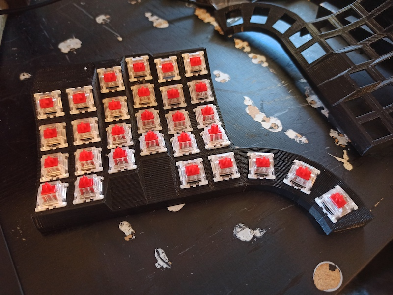

# Longhorn keyboard build

What is the longhorn keyboard ?


It's a split, sculpted, ortholinear keyboard.

It's a modified version of this keyboard by u/cyanophage : https://www.reddit.com/r/ErgoMechKeyboards/comments/i8e9xv/my_first_split_my_own_design/

Almost all the credits go to him, I ust modified his design, mostly to have a different thumb keys layout (fan out).

### Why is it called longhorn?

because: 

### Design

I started with the design by u/cyanophage and made some modifications.

- Removed the existing thumb keys.
- Replaced with a new circular thumb clusters.
- Added a caddy for the pro-micro (slightly different than the eliteC )
- Added a different jack caddy (jack module)

I used [OpenScad](https://www.openscad.org/) to tweak the design, in a linux VM as it's not signed to run on OSX.


See the [Design](/design) folder for the Scad and STL files

### Printing

Here is the STL [kb.stl](design/kb.stl), printed mirrored for the other hand.

I printed with my old Robo3D+ using black PLA filament.

I used [Cura](https://ultimaker.com/software/ultimaker-cura) for the slicing.

I print via [octopi](https://octoprint.org/) (raspberry pi connected to the printer).

Settings I used:

- Bed Temp: 50c
- Extruder temp: 210c
- Quality : fine (0.2mm)
- Support: yes, zig-zag. This needs good support and zig zag is fast and easy to remove
- Adhesion: used a raft, adds almost an hour to the print, but support adhesion to the bed was an issue without it.

Print time: ~ 9 hours per side.


### Parts

- wire 22awg solid : https://www.amazon.com/gp/product/B07TX6BX47/ref=ppx_yo_dt_b_asin_title_o05_s00?ie=UTF8&psc=1
- Keyboard switches(60+), for example: https://www.amazon.com/gp/product/B07X3SYQMV/ref=ppx_yo_dt_b_asin_title_o09_s00?ie=UTF8&psc=1
- 4pins TRSS jacks (2+): https://www.amazon.com/gp/product/B08331SNXD/ref=ppx_yo_dt_b_asin_title_o00_s00?ie=UTF8&psc=1
- 1N4148 Diodes (60+) : https://www.amazon.com/gp/product/B06XB1R2NK/ref=ppx_yo_dt_b_asin_title_o02_s01?ie=UTF8&psc=1
- Keycaps (60+): Any but cheap ones for starters: https://www.amazon.com/gp/product/B07GP29DQF/ref=ppx_yo_dt_b_asin_title_o02_s02?ie=UTF8&psc=1
- ProMicro controllers (2+) : https://www.amazon.com/gp/product/B08BJNV1J3/ref=ppx_yo_dt_b_asin_title_o02_s02?ie=UTF8&psc=1
- Optional: Ribbon wire: https://www.amazon.com/gp/product/B07PBGVCNL/ref=ppx_yo_dt_b_asin_title_o02_s00?ie=UTF8&psc=1
- Optional: small reset buttons: https://www.amazon.com/gp/product/B07ZV3PB26/ref=ppx_yo_dt_b_asin_title_o07_s00?ie=UTF8&psc=1

### Tools:

- Soldering iron + solder
- Small wire cutters / strippers
- Hot glue gun
- Helping hands really helps : https://www.amazon.com/Neiko-01902-Adjustable-Magnifying-Alligator/dp/B000P42O3C/ref=sr_1_5?dchild=1&keywords=helping+hands&qid=1599450972&sr=8-5

### Switches

Install all the switches



Then glue them in place:


Testing pinky/thumb placement :


### Install keycaops

You can do this either now or after the wiring, but better know if anything is off ASAP.


### Wiring

This is the part that is a ton of work.

My matrix is 6 cols \* 5 rows (per hand)
The thumb cluster is treated as row5 with keys in cols 2-6.

#### Rows

First I wired the rows, each key gets a diode to the row to avoid ghosting.

Make a little loop with each diode and solder it to each key.


Then I take a piece of wire and mark the diode pins location and use a razor knife to expose the wire core. Make surer to use solid wire for this, stranded wire would be a pain.


Then solder the diodes to the wire, and that's one row :


Repeat for all rows


### Columns

For the columns we don't need any diodes just connect with wire:


### Controller

Printed a caddy for the controller and jacks, see [micro.stl](design/micro.stl)


Wiring the controller os pretty difficult as it's very tiny and close together.

I used ribbon wire for this as it's less messy.

Here are the pins layout for the pro micro:


So first I soldered ribbon wires to the pro micro:

Best is to apply solder to the pro micro pins (little solder bubble), apply a bit of solder to the end of the wire, and then solder them together one by one.

Be careful not to have two pins getting soldered together.


What I have here is:

- top right : purple(GND) and white(RESET) wires are and going to the reset button.
- top left : orange(pin3 a.k.a D0), red(VCC) and brown(GND), goes to the TRSS jack connecting the two halves.
- bottom right : wires going to the 5 columns.
- bottom left : wires going to the 6 rows.

Wired up, with the TRSS & controller caddies glued:


### Jacks & Reset button

I glued the [jack.stl](design/jack.stl) caddies and wired the jacks.

Note: I messed the jacks up and had to redo them as I initially let some hot glue get inside the jack plug and they were not working.

I had not planned for reset buttons, so I drilled a hole to add them, I highly recommend reset buttons as it makes it so much easier to reflash your firmware as you figure out your keymap.


### Firmware

Up next is the firmware.


I created my 5\*6 matrixes and my custom layout and flashed them.

#### rules.mk

in [rules.mk](/qmk_firmware/keyboards/handwired/longhorn/rules.mk), most important parts:

```yaml
# config for pro micro :
MCU = atmega32u4
BOOTLOADER = caterina
# Yes, this is a split KB :
SPLIT_KEYBOARD = yes
```

#### config.h

First [config.h](/qmk_firmware/keyboards/handwired/longhorn/config.h), the most important bits are:

```c
// Specify what micro-controller pins are hoked up to rows and cols:
// Note: the pin names are no what is labelled on the pro-micro, see
// the pin diagram above in this page for reference.
#define MATRIX_ROW_PINS \
    { B6, B2, B3, B1, F7 }
#define MATRIX_COL_PINS \
    { B4, B5, E6, D7, C6, D4 }
// Specify the pin used for serial communicationbetween the halves,
// via the audio cable.
#define SOFT_SERIAL_PIN D0      // pin #3
// Specify our diodes directions, if you set that wrong, keys won't work
#define DIODE_DIRECTION COL2ROW
```

#### longhorn.h

[longhorn.h](/qmk_firmware/keyboards/handwired/longhorn/longhorn.h) defines our key matrix and how keys are laid out on each half.

Note that I wired up my columns "mirrored" (left to right on left hand, right t eft on right hand), so I had to invert the right hand entries in my layout to get the correct mapping, see the file for more info.

#### keymap.c

Finally [keymap.c](/qmk_firmware/keyboards/handwired/longhorn/keymaps/default/keymap.c) contains our keyboard layout (with multi layers etc ...)

Just open the file to see my current layout.

#### Flashing

First I built my firmware with build.sh

```
qmk compile -kb handwired/longhorn -km default
```

And then flashed it using [QMK Toolbox](https://qmk.fm/toolbox/)

It works best to use auto-flash and then press the kb reset button (auto-flash because pro-micro only gives you ~8 seconds to flash after pressing reset).


### End result:

It works great, next up is figuring out some baseplate and tenting, maybe 3D printed, maybe wood.


